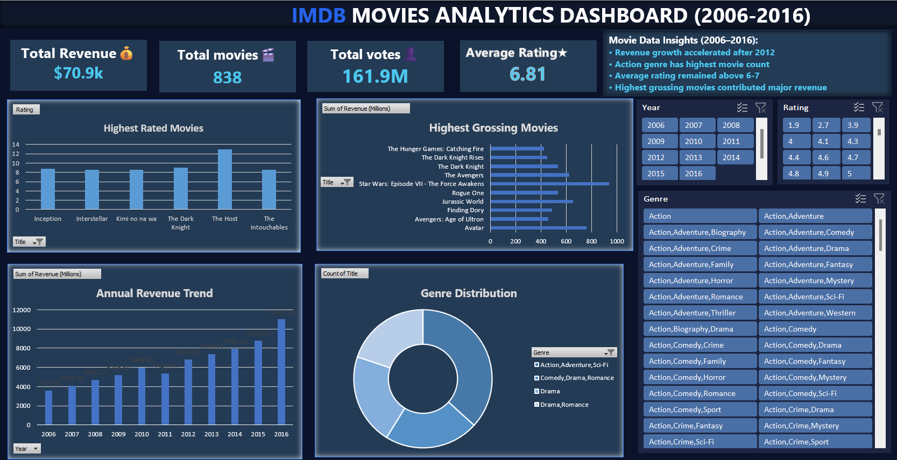

# 🎬 IMDB Movies Data Analysis Dashboard (Excel Project)

## 📌 Project Overview
This project is a professional Excel-based data analysis dashboard built using the IMDB Movies dataset.  
It analyzes movie trends such as ratings, revenue, genres, and yearly performance using Pivot Tables and interactive charts.

The goal of this project is to convert raw movie data into meaningful insights using Excel.

---

## 📊 Dashboard Preview

---

## 📂 Dataset Information
- Dataset: IMDB Movies Dataset (CSV converted to Excel)
- Contains:
  - Title
  - Genre
  - Director
  - Year of Release
  - Rating
  - Votes
  - Revenue (Millions)
  - Metascore

---

## 🛠️ Tools Used
- Microsoft Excel
- Pivot Tables
- Pivot Charts
- Slicers (Interactive Filters)
- Data Cleaning & Formatting

---

## 📊 Key Analysis Performed

### 🎬 Movie Trend Analysis
- Number of movies released per year

### ⭐ Rating Analysis
- Average rating by genre
- Identification of top-performing genres

### 💰 Revenue Analysis
- Revenue trends over years
- Year-wise performance comparison

### 🏆 Top Movies Analysis
- Top 10 highest-rated movies
- Comparison based on rating and votes

---

## 📈 Dashboard Features
- Interactive Excel Dashboard
- Slicers for filtering (Year, Genre, Director)
- KPI Cards (Total Movies, Avg Rating, Total Revenue)
- Dynamic Charts (Bar, Line, Column)

---

## 🔍 Key Insights
- Movie production has increased over time
- Drama and Action are top-performing genres
- Revenue varies significantly across years
- High-rated movies attract more votes and popularity

---

## 🎯 Learning Outcomes
- Data cleaning and preparation in Excel
- Pivot table analysis and aggregation
- Dashboard design and storytelling with data
- Turning raw data into business insights

---

## 👨‍💻 Author
- Name: Vinay
- Role: Data Science Enthusiast
- Skills: Excel, SQL, Power BI (Learning), Python (Beginner)

---

## 📌 Project Purpose
This project was created for learning and portfolio development to demonstrate data analysis and visualization skills using Excel.
